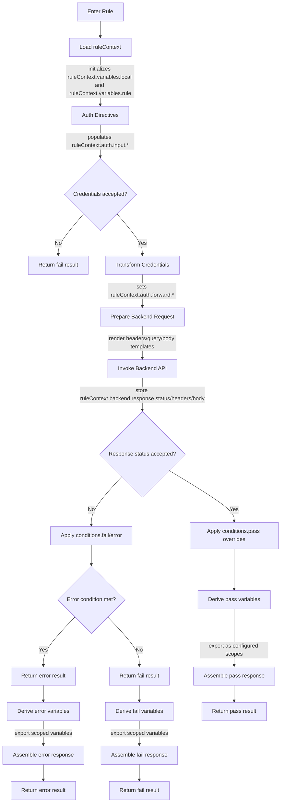

# UML Decision Flow Diagrams

This document captures high-level UML activity diagrams that illustrate the v2 decision flows for endpoints, rule chains, and individual rules. Each diagram highlights when key variables or cached objects are set so implementers can validate the control points against the prose design docs.

## Endpoint Decision Flow

```mermaid
flowchart TD
    A[HTTP Request Arrives] --> B[Extract rawState]
    B -->|sets endpointContext.rawState.*| C[Validate Forward Proxy Policy]
    C --> D{Trusted proxy?}
    D -- No --> E[Reject with 403]
    D -- Yes --> F[Authenticate Request]
    F -->|sets endpointContext.auth.status and .input.*| G{Auth satisfied?}
    G -- No --> H[Render responsePolicy.fail]
    G -- Yes --> I[Apply forwardRequestPolicy]
    I -->|sanitizes proxy headers when enabled| J[Enter Rule Chain]
    J --> K[Evaluate Rules Sequentially]
    K --> L{All rules pass?}
    L -- Yes --> M[responsePolicy.pass]
    L -- No --> N{Failure or Error?}
    N -- Failure --> O[responsePolicy.fail]
    N -- Error --> P[responsePolicy.error]
    M --> R[Render pass response (body/bodyFile if configured)]
    O --> V[Cache fail result per TTL if configured]
    P --> W[Bypass caching (5xx not cached)]
    M --> X[Cache pass result per TTL if configured]
    R --> Z[Send endpoint-defined response]
```

## Rule Chain Evaluation Flow

```mermaid
flowchart LR
    A[Start Rule Chain] --> B[Initialize chainContext]
    B -->|sets chainContext.variables.global from previous cache (if any)| C[Iterate rules by order]
    C --> D{Rule executes}
    D --> E[Capture rule outcome]
    E -->|append to chainContext.history| F{Pass?}
    F -- Yes --> G[Merge exported variables]
    F -- No --> H{Fail or Error?}
    H -- Fail --> I[Stop chain, mark failure]
    H -- Error --> J[Stop chain, mark error]
    G --> K{More rules?}
    K -- Yes --> C
    K -- No --> L[Mark chain success]
    I --> M[Expose fail variables to responsePolicy]
    J --> N[Expose error variables to responsePolicy]
    L --> O[Expose pass variables to responsePolicy]
```

## Individual Rule Execution Flow



### Variable Scope Notes

* `global` variables set in **Derive pass/fail/error variables** override earlier values for subsequent rules.
* `rule` variables are written to `chainContext.history[ruleName].variables` during response assembly.
* `local` variables remain inside `ruleContext` and are discarded after the rule returns.

