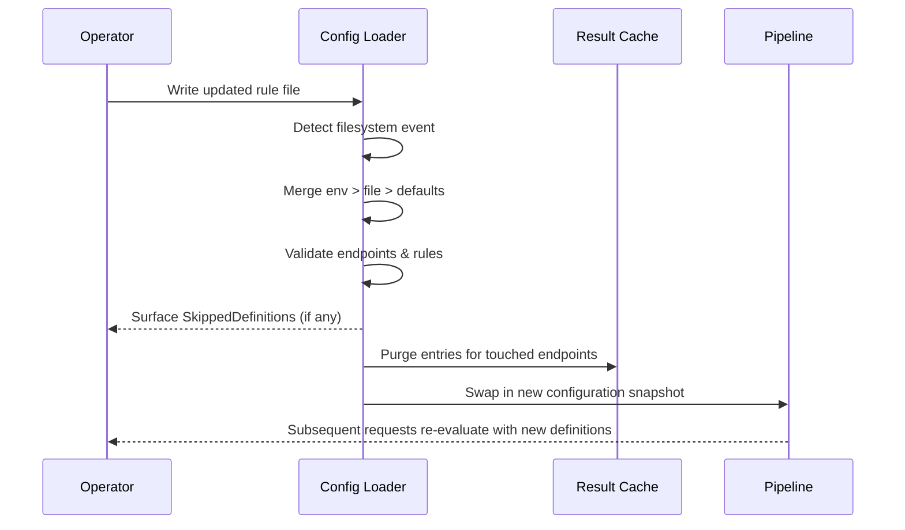

# Decision Pipeline Flows

Understanding PassCtrl’s pipeline makes it easier to predict how configuration changes affect callers and upstream services. This guide provides diagrams and annotated examples that connect settings to observable behavior.

## What You’ll Find

- Mermaid diagrams that trace the standard `/auth` path across runtime agents.
- Annotated examples showing how endpoint and rule settings shape upstream requests and downstream responses.
- Troubleshooting pointers that link log fields and `SkippedDefinitions` metadata back to configuration sources.

The diagrams in this stage align with the runtime contracts described in [`design/system-agents.md`](../../design/system-agents.md) and [`design/request-flows.md`](../../design/request-flows.md).

## End-to-End `/auth` Decision

```mermaid
flowchart LR
    A[Incoming HTTP request] --> B[Admission & Raw State]
    B --> C{Authenticated?\n(trusted proxy + credentials)}
    C -- No --> R1[Response Policy · fail]
    C -- Yes --> D[Forward Request Policy]
    D --> E[Rule Chain]
    E --> F{Rule outcome}
    F -- pass --> RP1[Response Policy · pass]
    F -- fail --> RP2[Response Policy · fail]
    F -- error --> RP3[Response Policy · error]
    RP1 --> G{Endpoint Cache Enabled?}
    RP2 --> G
    RP3 --> G
    G -- Yes & cacheable --> H[Persist decision metadata]
    G -- No --> I[Return HTTP response]
    H --> I
```

- **Admission & Raw State** authenticates the caller, enforces trusted proxies, and seeds `.auth` / `.raw` for later templates.
- **Forward Request Policy** strips or synthesizes headers and query parameters before backends see the request.
- **Rule Chain** executes rules sequentially until one returns pass/fail/error. Each rule records its outcome, latency, and exported variables.
- **Response Policy** merges endpoint defaults with decisive rule overrides to render the HTTP status, headers, and body sent back to the caller.
- **Result Cache** stores decision metadata (never backend bodies). Cache hits replay responses and skip backend calls.

## Example: Token Introspection Endpoint

```yaml
endpoints:
  introspection:
    authentication:
      required: true
      allow: ["bearer"]
    forwardProxyPolicy:
      trustedProxyIPs: ["10.0.0.0/8", "192.168.0.0/16"]
      developmentMode: false
    forwardRequestPolicy:
      forwardProxyHeaders: true
      headers:
        allow: ["x-request-id", "x-forwarded-for", "x-forwarded-proto"]
        strip: ["authorization"]
        custom:
          x-trace-id: "{{ index .raw.headers \"x-request-id\" }}"
      query:
        allow: ["trace_id"]
        strip: []
        custom: {}
    rules:
      - name: introspect-bearer-token
      - name: require-active-subscription
    responsePolicy:
      pass:
        status: 200
      fail:
        status: 403
        body: |
          {
            "error": "access denied"
          }
    cache:
      resultTTL: 120s

rules:
  introspect-bearer-token:
    backendApi:
      url: https://identity.example.com/v1/introspect
      method: POST
      headers:
        custom:
          authorization: "Bearer {{ .auth.input.token }}"
          content-type: application/json
      body: |
        {"token": "{{ .auth.input.token }}"}
      acceptedStatuses: [200]
    conditions:
      pass:
        - backend.status == 200 && lookup(backend.body, "active") == true
      fail:
        - backend.status == 200 && lookup(backend.body, "active") == false
      error:
        - backend.status >= 500
    responses:
      fail:
        status: 403
        body: |
          {"error": "subscription check failed"}
    variables:
      global:
        validated_token:
          from: backend.body.token
        subscription_plan:
          from: backend.body.plan
    cache:
      passTTL: 90s
      failTTL: 0s
      followCacheControl: true

  require-active-subscription:
    conditions:
      pass:
        - lookup(vars.global, "validated_token") != "" && lookup(vars.global, "subscription_plan") in ["plus", "enterprise"]
      fail:
        - lookup(vars.global, "subscription_plan") == "expired"
        - lookup(vars.global, "validated_token") == ""
    responses:
      fail:
        status: 403
        body: |
          {
            "error": "subscription check failed",
            "plan": "{{ index .vars.global \"subscription_plan\" }}"
          }
```

> The configuration above matches `examples/configs/backend-token-introspection.yaml`.

### Flow Highlights

- **Upstream request**: Forwards the caller’s Bearer token in the JSON body only—no headers are replayed beyond those whitelisted in `forwardRequestPolicy`.
- **Response shaping**: When `backend.body.active` is `false`, the fail response is rendered with status `403` and a templated JSON body drawn from the upstream payload.
- **Caching**: Successful decisions persist for `120s`. Follow-up calls with the same token and curated headers reuse the cached response and skip the backend call. A fail decision is also cached for `120s`, so repeat failures return immediately.
- **Variables**: `variables.global.validated_token` and `variables.global.subscription_plan` feed downstream rules and response templates so only paid subscribers receive pass responses.

## Runtime Agent Cheat Sheet

| Agent | Responsibility | Key Observability |
| --- | --- | --- |
| Server Configuration & Lifecycle | Loads configuration, performs validation, tracks `RuleSources` and `SkippedDefinitions`. | `component=server`, `agent=configuration`, hot-reload logs, `/explain` metadata. |
| Admission & Raw State | Authenticates, enforces trusted proxies, records immutable request snapshot. | `agent=admission`, outcome/time fields, `/explain` admission block. |
| Forward Request Policy | Normalises headers/query parameters fed to rules/backends. | `agent=forward-request`, curated header list in debug logs. |
| Rule Chain & Rule Execution | Executes rules sequentially, records history, surfaces backend summaries. | `agent=rule-chain` and `agent=rule`, includes `rule`, `outcome`, `latency_ms`, `cache_hit`. |
| Response Policy | Renders final status, headers, and body. | `agent=response-policy`, includes `status`, `template`, `source=rule|endpoint`. |
| Result Caching | Stores pass/fail decisions, honours TTLs and backend cache hints. | `agent=result-cache`, fields `cache_hit`, `cache_ttl`, `cache_backend`. |

## Troubleshooting Tips

- **`/explain` endpoint**: Inspect `RuleSources`, `SkippedDefinitions`, cache stats, and the evaluated rule graph without executing rules.
- **Structured logs**: Correlate entries using the configured `correlationHeader`. Filter by `agent` and `outcome` to trace specific stages.
- **Common pitfalls**:
  - Missing rule names: Endpoint health shows `missing rule dependencies: <rule>` (fix the rules folder/file).
  - Unexpected headers upstream: Revisit `forwardRequestPolicy.headers.allow` and `strip` order; remember wildcards apply before strips.
  - Caches not invalidating: Confirm the rules folder exists and that writes occur atomically so hot reloads trigger cache eviction.

## Hot Reload & Cache Invalidation



Successful reloads invalidate cached decisions linked to the edited endpoints or rules. Operators should write changes atomically (e.g., `mv new.yaml rules/`) so the loader never ingests half-written files.

> Example: `examples/suites/rules-folder-bundle/` demonstrates a watched `rulesFolder` with multiple rule files so you can observe hot reload and cache invalidation in action.
